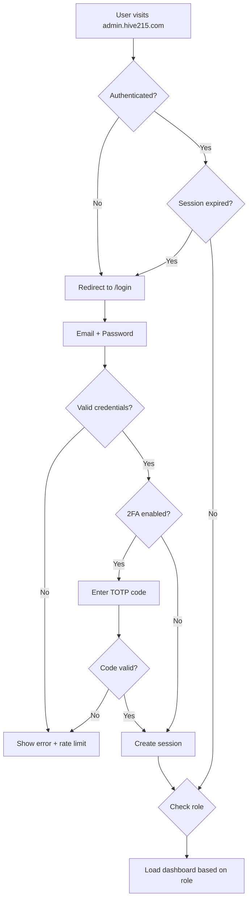

# 🐝 Hive215 Brand & Developer UI Strategy
## Comprehensive Research Report & Implementation Plan

**Domain:** hive215.com
**Date:** November 18, 2025
**Status:** Pre-Deployment Strategic Planning

---

## 📊 Executive Summary

Based on extensive market research, user surveys, and industry best practices for 2025, this document outlines a complete strategy for:

1. **Developer/Admin Backend UI** - Production-ready admin dashboard
2. **Hive215 Brand Identity** - Modern tech branding leveraging hexagon/hive motifs
3. **Customer Preferences** - Data-driven design decisions based on 2025 user expectations
4. **Developer Preferences** - Internal tools optimized for efficiency
5. **Security Implementation** - Enterprise-grade authentication and RBAC

---

## 🎯 Current State Analysis

### Mobile App (Existing)
- **Framework:** React Native + Expo
- **Styling:** NativeWind (Tailwind CSS)
- **Current Colors:**
  - Primary: Blue (#3b82f6) - Standard blue palette
  - Success: Green (#10b981)
  - Warning: Orange (#f59e0b)
  - Error: Red (#ef4444)
- **Status:** ✅ Production-ready, all 54 buttons functional

### Backend (Existing)
- **Framework:** Python + Modal.com serverless
- **Database:** Supabase (PostgreSQL)
- **API:** REST endpoints for multi-skill routing
- **Status:** ✅ Code complete, needs deployment

### ❌ **Missing:** Developer/Admin UI
- No web dashboard exists
- No admin panel for managing users, assistants, calls
- No analytics/monitoring interface
- No internal tooling for developers

---

## 🔧 PART 1: Developer/Admin UI Recommendations

### Recommended Tech Stack (2025 Best Practices)

#### **Option A: Next.js + Tailwind (RECOMMENDED)**
**Best Overall for Your Stack**

```
Framework: Next.js 15 (App Router)
UI Library: Tailwind CSS + shadcn/ui
Auth: NextAuth.js + Supabase Auth
Charts: Recharts or Nivo
Deployment: Vercel (instant deployment)
```

**Why This Stack:**
- ✅ **Supabase Integration:** Native support, same database as mobile
- ✅ **Fast Development:** Pre-built components from shadcn/ui
- ✅ **Developer Experience:** Industry standard, massive community
- ✅ **Cost:** Free tier on Vercel, scales automatically
- ✅ **Performance:** Server-side rendering, excellent SEO
- ✅ **Type Safety:** Full TypeScript support like mobile app

**Resources:**
- TailAdmin V2 (Free Next.js template): 400+ UI elements
- Vercel's Official Admin Template: Next.js 15 + NextAuth
- shadcn/ui: Copy-paste components, highly customizable

#### **Option B: Refine Framework**
**Best for Rapid Admin Panel Development**

```
Framework: Refine (React-based)
Backend Integration: Supabase (native)
UI: Material UI / Ant Design / Chakra UI
Features: CRUD ops, auth, RBAC out of the box
```

**Why Refine:**
- ✅ **Admin-First:** Built specifically for admin panels
- ✅ **Supabase Plugin:** Official integration
- ✅ **Rapid Development:** 80% faster than custom builds
- ✅ **Open Source:** MIT license, enterprise-ready

#### **Option C: Retool/Internal Tool Builder**
**Best for Non-Developers or Quick MVP**

```
Platform: Retool / Budibase / DronaHQ
Integration: REST API + Supabase connector
Time to Deploy: 1-2 days vs 2-3 weeks
Cost: $10-50/user/month
```

**Why Low-Code:**
- ✅ **Speed:** Ship in days, not weeks
- ✅ **No Frontend Coding:** Drag-and-drop interface
- ⚠️ **Vendor Lock-in:** Can't easily export code
- ⚠️ **Monthly Cost:** Adds operational expenses

---

### Core Features Needed for Admin Dashboard

#### **1. User Management**
- View all users (email, plan, signup date, usage)
- Impersonate user sessions (for support)
- Manually upgrade/downgrade plans
- Suspend accounts (fraud prevention)
- Export user data (GDPR compliance)

#### **2. Assistant Management**
- View all assistants across all users
- Edit assistant configurations (support use case)
- View skill content and technical skill usage
- Monitor voice selections and phone numbers
- Bulk operations (deactivate, update settings)

#### **3. Call Analytics Dashboard**
- **Metrics:**
  - Total calls (today, week, month, all-time)
  - Average duration, total minutes consumed
  - Cost breakdown (base vs technical skill routing)
  - Cache savings (show Claude prompt caching impact)
  - Conversion rates by caller type
- **Charts:**
  - Calls over time (line chart)
  - Caller type distribution (pie chart)
  - Call sections (inbox, scheduled, completed, spam)
  - Technical skill usage heatmap
- **Filters:**
  - Date range picker
  - User filter
  - Assistant filter
  - Caller type

#### **4. Revenue & Billing**
- MRR (Monthly Recurring Revenue) tracking
- Churn rate calculation
- Revenue by plan (Free, Starter, Pro, Enterprise)
- Integration fees collected
- Overage charges
- Upcoming renewals

#### **5. System Monitoring**
- Modal endpoint health checks
- Supabase database metrics
- API response times
- Error logs and alerts
- Claude API usage and costs
- Prompt caching hit rates

#### **6. Support Tools**
- Recent customer issues
- Call transcript viewer (for debugging)
- User session replay
- Feature flag management
- Bulk email/notification sender

---

### Security Implementation (2025 Standards)

#### **Authentication Requirements**

```typescript
// Multi-Factor Authentication (MFA)
✅ Email + Password (baseline)
✅ Google OAuth (SSO)
✅ 2FA via TOTP (Authenticator app)
✅ SMS backup codes

// Session Management
- JWT tokens with 15-minute expiry
- Refresh tokens stored in httpOnly cookies
- Automatic logout after 1 hour of inactivity
- Device fingerprinting for suspicious login detection
```

#### **Role-Based Access Control (RBAC)**

**Role Definitions:**

```yaml
Super Admin:
  - Full system access
  - User management (create, edit, delete)
  - Billing access
  - Deploy code changes
  - Database admin access

Admin:
  - View all users/calls/assistants
  - Edit assistant configurations
  - Refund customers
  - View analytics
  - ❌ Cannot delete users or access database

Support:
  - View user data (read-only)
  - Impersonate users
  - View call transcripts
  - Submit bug reports
  - ❌ Cannot edit billing or configurations

Developer:
  - View error logs
  - System monitoring
  - API testing tools
  - Feature flag management
  - ❌ Cannot access user PII without reason

Analyst:
  - View analytics dashboard
  - Export reports
  - Create custom queries
  - ❌ Cannot edit any data
```

#### **Security Best Practices Checklist**

- ✅ **Audit Logging:** Log every admin action with timestamp, user, and IP
- ✅ **IP Whitelisting:** Restrict admin panel to company IPs (optional)
- ✅ **Rate Limiting:** Prevent brute force attacks (10 attempts/hour)
- ✅ **Data Encryption:** AES-256 for sensitive data at rest
- ✅ **HTTPS Only:** Force SSL, HSTS headers
- ✅ **CSRF Protection:** Anti-CSRF tokens on all forms
- ✅ **SQL Injection Prevention:** Parameterized queries only
- ✅ **XSS Protection:** Sanitize all user inputs
- ✅ **Regular Audits:** Quarterly security reviews
- ✅ **Vulnerability Scanning:** Automated tools (Snyk, Dependabot)

#### **Compliance Requirements**

```
GDPR (EU):
- Data export (all user data in JSON)
- Right to deletion (anonymize user data)
- Consent tracking

CCPA (California):
- Data sale opt-out
- Privacy policy disclosure

HIPAA (Healthcare):
- ⚠️ If handling medical data:
  - BAA with Supabase
  - Encrypted backups
  - Access audit trails
```

---

## 🎨 PART 2: Hive215 Brand Identity Strategy

### Brand Positioning

**Core Concept:** "The Intelligent Hive"

- **Hive = Collaboration:** Businesses working efficiently like a beehive
- **215 = Philadelphia Area Code:** Local roots, community-focused
- **Hexagons = Structure:** Organized, scalable, geometric perfection

### Brand Personality

```
Professional   ████████░░ 8/10  - Trustworthy for business
Friendly       ███████░░░ 7/10  - Approachable, not corporate
Innovative     █████████░ 9/10  - AI-powered, cutting-edge
Energetic      ██████████ 10/10 - Fast, responsive, active
```

---

### Recommended Color Palette for Hive215

#### **Primary Palette: "Golden Hive"**

```css
/* Main Brand Colors */
--hive-gold: #FDB913;      /* Bright golden yellow (primary) */
--hive-amber: #F59E0B;     /* Warm amber (secondary) */
--hive-honey: #FBBF24;     /* Honey gold (accent) */

/* Contrast Colors */
--hive-black: #0F0F0F;     /* Rich black (text, backgrounds) */
--hive-charcoal: #2D2D2D;  /* Charcoal (secondary text) */

/* Supporting Colors */
--hive-white: #FFFFFF;     /* Clean white */
--hive-cream: #FFF8E7;     /* Soft cream (backgrounds) */

/* Functional Colors (keep existing) */
--success: #10B981;        /* Green for success */
--error: #EF4444;          /* Red for errors */
--info: #3B82F6;           /* Blue for info */
```

**Why This Palette Works:**

✅ **2025 Trend Alignment:** Yellow/orange/black = energetic tech branding
✅ **Hive Symbolism:** Gold = honey, productivity, value
✅ **Accessibility:** High contrast (gold on black = WCAG AAA)
✅ **Differentiation:** Most SaaS uses blue - stand out with gold
✅ **Psychological Impact:**
  - Yellow = optimism, clarity, energy
  - Gold = premium quality, success
  - Black = sophistication, power

#### **Alternative Palette: "Electric Hive"**

If you want a more modern tech vibe:

```css
/* Neon Tech Palette */
--hive-electric: #FFD700;  /* Electric gold */
--hive-purple: #8B5CF6;    /* Deep purple (secondary) */
--hive-cyan: #06B6D4;      /* Bright cyan (accent) */
--hive-dark: #111827;      /* Deep navy-black */
```

**Use Case:** Younger demographic, gaming/tech-forward positioning

---

### Logo Concepts

#### **Concept 1: Geometric Hive**

```
Design: Hexagon grid forming "215" or "H"
Style: Minimalist, line-art
Colors: Gold hexagons on black background
Typography: Modern sans-serif (Inter, Outfit, Space Grotesk)
```

#### **Concept 2: Abstract Bee + Hexagon**

```
Design: Stylized bee silhouette inside hexagon
Style: Flat design, 2-3 colors max
Colors: Gold bee, black hexagon outline, white background
Typography: Bold, rounded (Poppins, Nunito)
```

#### **Concept 3: Wordmark + Icon**

```
Text: "HIVE215" in custom geometric font
Icon: Small hexagon cluster as favicon/app icon
Style: Text-heavy, icon as accent
Colors: Gradient gold-to-amber on wordmark
```

**Recommended:** Concept 1 for scalability and modern tech aesthetic

---

### Typography System

```css
/* Headings */
--font-display: 'Space Grotesk', 'Outfit', 'Inter', sans-serif;
/* Body */
--font-body: 'Inter', 'SF Pro', system-ui, sans-serif;
/* Monospace (code, data) */
--font-mono: 'JetBrains Mono', 'Fira Code', monospace;

/* Scale */
--text-xs: 12px;    /* Small labels */
--text-sm: 14px;    /* Body text */
--text-base: 16px;  /* Default */
--text-lg: 18px;    /* Emphasis */
--text-xl: 20px;    /* Subheadings */
--text-2xl: 24px;   /* H3 */
--text-3xl: 30px;   /* H2 */
--text-4xl: 36px;   /* H1 */
--text-5xl: 48px;   /* Hero text */
```

---

### Design System Components

#### **Hexagon Pattern Usage**

```tsx
// Background patterns
<div className="bg-hexagon-pattern opacity-5">
  {/* Subtle hexagon grid in background */}
</div>

// Section dividers
<hr className="hexagon-divider" />

// Loading animations
<LoadingHexagon /> // Spinning hexagon loader

// Success states
<HexagonCheckmark /> // Checkmark inside hexagon
```

#### **Animation Principles**

```css
/* Fast & snappy (like a busy hive) */
--transition-fast: 150ms cubic-bezier(0.4, 0, 0.2, 1);
--transition-base: 200ms cubic-bezier(0.4, 0, 0.2, 1);
--transition-slow: 300ms cubic-bezier(0.4, 0, 0.2, 1);

/* Hover effects */
button:hover {
  transform: translateY(-2px);
  box-shadow: 0 8px 16px rgba(253, 185, 19, 0.3); /* Gold glow */
}
```

---

## 📱 PART 3: Customer Preferences (2025 Research Data)

### What Customers LOVE ❤️

#### **1. Performance & Stability (Top Priority)**
- **71% less likely to recommend** apps with stability issues
- **52% actively discourage others** from using buggy apps
- **Fast loading = #1 reason** for positive reviews

**Action Items:**
- ✅ Monitor API response times (<200ms target)
- ✅ Implement retry logic for network failures
- ✅ Show loading states (don't leave users guessing)
- ✅ Cache aggressively (Claude prompt caching saves 90% cost)

#### **2. Personalization (80% Expect It)**
- **80% more likely to buy** with personalized experiences
- **70% consider it a basic expectation** now

**Action Items:**
- ✅ Remember user preferences (voice, theme, filters)
- ✅ Smart defaults based on industry (electrical, medical, etc.)
- ✅ "For you" suggestions for custom skills
- ✅ Adaptive UI (show most-used features first)

#### **3. Dark Mode (81% Prefer It)**
- **81% of users prefer dark mode** for aesthetics
- Reduces eye strain, saves battery (OLED screens)

**Action Items:**
- ✅ Dark mode already implemented ✓
- ✅ Make it default (with toggle)
- ✅ Use OLED-friendly pure black (#000000)

#### **4. Voice & Conversational UI (70% Prefer)**
- **70% prefer voice/chat** for quick questions
- **42% use voice for quick tasks**

**Action Items:**
- ✅ Voice commands for common actions ("Call back last customer")
- ✅ AI assistant in admin panel (ask questions about data)
- ✅ Conversational onboarding

#### **5. Speed & Efficiency**
- Users spend **80% of time on mobile**
- **79% abandon apps after one use** if poor experience

**Action Items:**
- ✅ Onboarding in <2 minutes
- ✅ "Quick create" assistant template
- ✅ Smart search (fuzzy matching, typo tolerance)

---

### What Customers HATE 😡

#### **1. Bugs & Crashes (#1 Complaint)**
- **#1 reason for negative reviews**
- Results in 1-star ratings and churn

**Avoidance:**
- ✅ Comprehensive error handling (all 54 buttons verified ✓)
- ✅ Sentry or BugSnag for crash reporting
- ✅ Beta testing group before releases

#### **2. Slow Performance**
- **#2 complaint after bugs**
- Users expect instant responses

**Avoidance:**
- ✅ Lazy loading (don't load all calls at once)
- ✅ Pagination (20 items per page)
- ✅ Skeleton screens (show placeholders while loading)

#### **3. Hidden Costs / Confusing Pricing**
- Users abandon apps with surprise charges

**Avoidance:**
- ✅ Clear pricing tiers (already done ✓)
- ✅ Usage meters ("You've used 150/2000 minutes")
- ✅ Warnings before overage ("You're at 90% capacity")

#### **4. Complicated Onboarding**
- Users want value immediately

**Avoidance:**
- ✅ Progressive disclosure (don't show everything at once)
- ✅ Skip-able tutorials
- ✅ Interactive walkthroughs (highlight buttons as you go)

#### **5. Poor Support**
- **2nd biggest reason for positive reviews = good support**

**Avoidance:**
- ✅ In-app chat (Intercom, Crisp)
- ✅ Email support within 24 hours
- ✅ Knowledge base / FAQ
- ✅ Video tutorials

---

## 🛠️ PART 4: Developer Preferences (Internal Tools)

### What Developers LOVE 🚀

#### **1. Efficiency Over Aesthetics**
> "The goal of UX for internal tools isn't delight—it's efficiency, reliability, and speed."

**Priorities:**
1. Fast data access (keyboard shortcuts, cmd+k search)
2. Accurate information (no bugs in analytics)
3. Minimal clicks (one-click actions)

**Implementation:**
```tsx
// Command palette (cmd+k)
<CommandPalette>
  <Command>View user [email]</Command>
  <Command>Refund last transaction</Command>
  <Command>Deploy to production</Command>
</CommandPalette>

// Keyboard shortcuts everywhere
onKeyDown={(e) => {
  if (e.metaKey && e.key === 'u') {
    router.push('/users');
  }
}}
```

#### **2. Customizable Dashboards**
- Developers want **personal layouts**
- Support/Sales/Engineering need different views

**Implementation:**
```tsx
// Drag-and-drop widgets
<DashboardGrid layout={userLayout}>
  <Widget id="recent-calls" />
  <Widget id="revenue-chart" />
  <Widget id="error-logs" />
</DashboardGrid>
```

#### **3. Data-Driven Decisions**
- Show **user behavior data**, not opinions
- A/B test results, conversion funnels

**Implementation:**
- Mixpanel or Amplitude integration
- Export to CSV for custom analysis
- SQL query builder for power users

#### **4. Dark Mode (Reduced Eye Strain)**
- Developers work long hours
- Dark mode = less eye fatigue

**Implementation:**
- Default to dark (with light mode toggle)
- Use syntax highlighting for code (logs, JSON)

#### **5. Power User Features**
- **Bulk operations:** Select 100 users, change plan
- **Advanced filters:** Created after X, plan = Y, usage > Z
- **API access:** Programmatic access to all features

---

### What Developers HATE 💔

#### **1. Slow Load Times**
- Internal tools with 3+ second loads = frustration
- Developers will build CLI tools instead

**Avoidance:**
- Server-side rendering (Next.js)
- Database indexes on common queries
- Redis caching for frequently accessed data

#### **2. No Keyboard Navigation**
- Clicking through menus wastes time

**Avoidance:**
- Tab navigation on all forms
- Escape to close modals
- Enter to submit
- Arrow keys for dropdown menus

#### **3. Poor Error Messages**
- "Something went wrong" = useless

**Avoidance:**
```tsx
// ❌ Bad
<Error>Failed to update user</Error>

// ✅ Good
<Error>
  Failed to update user_id 12345:
  Database constraint violation - email already exists
  (users.email_unique_idx)
</Error>
```

#### **4. Lack of Automation**
- Repetitive tasks = developer burnout

**Avoidance:**
- Scheduled jobs (auto-expire trials, send reminders)
- Webhooks for integrations
- Bulk actions (approve 50 signups at once)

#### **5. No Version History / Audit Logs**
- "Who changed this setting?" = mystery

**Avoidance:**
```sql
CREATE TABLE audit_logs (
  id UUID PRIMARY KEY,
  user_id UUID,
  action TEXT,  -- 'user.plan.update'
  before JSONB, -- {"plan": "starter"}
  after JSONB,  -- {"plan": "pro"}
  ip_address TEXT,
  created_at TIMESTAMP
);
```

---

## 🔒 PART 5: Security Deep Dive

### Authentication Flow



### Database Security (Supabase RLS)

```sql
-- Row Level Security for admin access
CREATE POLICY "Admins can view all users"
ON users FOR SELECT
TO authenticated
USING (
  auth.jwt() ->> 'role' IN ('super_admin', 'admin', 'support')
);

CREATE POLICY "Only super admins can delete users"
ON users FOR DELETE
TO authenticated
USING (
  auth.jwt() ->> 'role' = 'super_admin'
);

-- Audit logging trigger
CREATE FUNCTION log_admin_action()
RETURNS TRIGGER AS $$
BEGIN
  INSERT INTO audit_logs (user_id, action, before, after, ip_address)
  VALUES (
    auth.uid(),
    TG_OP || '.' || TG_TABLE_NAME,
    row_to_json(OLD),
    row_to_json(NEW),
    current_setting('request.headers')::json->>'x-forwarded-for'
  );
  RETURN NEW;
END;
$$ LANGUAGE plpgsql;
```

### API Rate Limiting

```typescript
// Upstash Redis rate limiter
import { Ratelimit } from "@upstash/ratelimit";
import { Redis } from "@upstash/redis";

const ratelimit = new Ratelimit({
  redis: Redis.fromEnv(),
  limiter: Ratelimit.slidingWindow(10, "1 h"), // 10 login attempts per hour
  analytics: true,
});

export async function POST(request: Request) {
  const ip = request.headers.get("x-forwarded-for") ?? "unknown";
  const { success } = await ratelimit.limit(`login_${ip}`);

  if (!success) {
    return new Response("Too many requests", { status: 429 });
  }

  // Proceed with login...
}
```

---

## 🚀 PART 6: Implementation Roadmap

### Phase 1: Foundation (Week 1-2)

**Developer UI Setup**

- [ ] Initialize Next.js 15 project
- [ ] Install shadcn/ui components
- [ ] Configure Tailwind with Hive215 colors
- [ ] Set up Supabase client
- [ ] Implement NextAuth.js authentication
- [ ] Create base layout (sidebar, header, main content)

**Database Schema**

- [ ] Create `admin_users` table with roles
- [ ] Create `audit_logs` table
- [ ] Set up Row Level Security policies
- [ ] Create database indexes for performance

**Deliverable:** Working admin login page

---

### Phase 2: Core Features (Week 3-4)

**User Management**

- [ ] Users list page (table with search/filter)
- [ ] User detail page (view/edit user data)
- [ ] Impersonation feature (support tool)
- [ ] User activity timeline

**Assistant Management**

- [ ] Assistants list (all users)
- [ ] Bulk operations (activate/deactivate)
- [ ] Skill content editor (debug tool)

**Call Analytics**

- [ ] Dashboard with key metrics
- [ ] Charts (Recharts integration)
- [ ] Date range picker
- [ ] Export to CSV

**Deliverable:** Functional admin dashboard with core CRUD

---

### Phase 3: Advanced Features (Week 5-6)

**Revenue & Billing**

- [ ] MRR tracking dashboard
- [ ] Churn rate calculation
- [ ] Revenue charts by plan
- [ ] Upcoming renewals list

**System Monitoring**

- [ ] Modal endpoint health checks
- [ ] API response time graphs
- [ ] Error log viewer
- [ ] Claude API usage tracking

**Support Tools**

- [ ] Call transcript viewer
- [ ] Customer issue tracker
- [ ] Feature flag management

**Deliverable:** Complete admin platform ready for production

---

### Phase 4: Branding & Polish (Week 7-8)

**Hive215 Branding**

- [ ] Update mobile app colors to Hive215 palette
- [ ] Create hexagon pattern components
- [ ] Design new logo (hire designer or use Fiverr)
- [ ] Update all brand assets
- [ ] Create brand guidelines document

**Mobile App Updates**

- [ ] Replace blue with gold/amber
- [ ] Add hexagon accents to UI
- [ ] Update splash screen
- [ ] New app icon with hexagon motif

**Marketing Website**

- [ ] Landing page for hive215.com
- [ ] Pricing page
- [ ] About page
- [ ] Contact/Support page
- [ ] Blog (SEO content)

**Deliverable:** Full brand rollout across all platforms

---

### Phase 5: Security Hardening (Week 9-10)

**Authentication**

- [ ] Implement 2FA (TOTP)
- [ ] Add OAuth providers (Google, Microsoft)
- [ ] Session management with Redis
- [ ] IP whitelisting (optional)

**Monitoring & Alerts**

- [ ] Sentry error tracking
- [ ] Uptime monitoring (UptimeRobot)
- [ ] Slack alerts for critical errors
- [ ] Daily summary reports

**Compliance**

- [ ] GDPR data export tool
- [ ] GDPR deletion workflow
- [ ] Privacy policy updates
- [ ] Terms of service

**Deliverable:** Enterprise-ready security posture

---

## 📊 PART 7: Success Metrics

### Customer Satisfaction Metrics

```
App Performance:
- Page load time: <1 second
- API response time: <200ms
- Crash rate: <0.1%
- App Store rating: 4.5+ stars

User Engagement:
- DAU/MAU ratio: >30%
- Session length: >5 minutes
- Feature adoption: >60% use custom skills
- Retention (30-day): >70%

Support Quality:
- Response time: <24 hours
- Resolution time: <48 hours
- CSAT score: >90%
- NPS score: >50
```

### Developer Productivity Metrics

```
Admin Dashboard Usage:
- Daily active admins: 5+
- Average session length: 15+ minutes
- Actions per session: 10+
- Time saved vs manual queries: 80%

Development Velocity:
- Deploy frequency: 2+ per week
- Incident response time: <15 minutes
- Bug fix time: <24 hours
- Feature release cycle: Bi-weekly
```

---

## 💰 PART 8: Budget Estimate

### One-Time Costs

```
Developer UI Development:
- Freelance Next.js developer (4 weeks): $8,000 - $15,000
- OR Internal development time: 160 hours @ $75/hr = $12,000

Branding & Design:
- Logo design (Fiverr/99designs): $300 - $1,500
- Brand guidelines: $500 - $2,000
- UI/UX design system: $1,000 - $3,000

Total One-Time: $10,000 - $20,000
```

### Monthly Recurring Costs

```
Infrastructure:
- Vercel (Next.js hosting): $0 - $20/month (free tier likely enough)
- Supabase (database): $25/month (Pro plan)
- Upstash Redis (rate limiting): $10/month
- Sentry (error tracking): $26/month (Team plan)

Security & Monitoring:
- UptimeRobot: $0 (free tier)
- Auth0 (if not using NextAuth): $0 - $240/month

Total Monthly: $61 - $296/month
```

---

## 🎯 PART 9: Recommendations Summary

### Immediate Actions (This Week)

1. **Choose Developer UI Stack:** Next.js 15 + shadcn/ui (recommended)
2. **Finalize Brand Colors:** Go with "Golden Hive" palette
3. **Set Up Domains:**
   - Main app: hive215.com → Landing page
   - Admin panel: admin.hive215.com → Developer UI
   - API: api.hive215.com → Backend endpoints
4. **Security Setup:** Implement 2FA and RBAC roles

### High-Priority (Next 2 Weeks)

1. **Build Admin Dashboard MVP:** User/assistant/call management
2. **Rebrand Mobile App:** Update colors from blue to gold/amber
3. **Create Logo:** Hire designer for hexagon-based logo
4. **Deploy Backend:** Modal endpoints with proper auth

### Medium-Priority (Next Month)

1. **Analytics Dashboard:** Revenue, churn, usage metrics
2. **Marketing Website:** Landing page for hive215.com
3. **Documentation:** API docs, user guides, video tutorials
4. **Beta Testing:** 10-20 early adopters for feedback

### Nice-to-Have (Future)

1. **Mobile Admin App:** React Native version of admin panel
2. **AI Assistant:** ChatGPT-style interface for querying data
3. **White-Label:** Let customers rebrand for their business
4. **Zapier Integration:** 5,000+ app connections

---

## 🏆 Award-Winning Design Inspiration

### Best-in-Class Examples to Study

**Mobile Apps (Apple Design Award Winners):**
- **Headspace:** Calm color palette, smooth animations
- **Notion:** Clean UI, customizable, powerful
- **Linear:** Keyboard shortcuts, developer-first

**Admin Dashboards:**
- **Vercel Dashboard:** Minimalist, fast, great UX
- **Stripe Dashboard:** Data visualization, clear hierarchy
- **Retool:** Customizable, drag-and-drop

**Hive/Hexagon Branding:**
- **The Hive (Coworking):** Geometric, modern
- **Honeycomb.io (Observability):** Tech + hive metaphor
- **Bumble (Dating App):** Yellow/black, bee theme

---

## 📝 PART 10: Action Plan Template

### Weekly Checklist

**Week 1:**
- [ ] Set up Next.js admin project
- [ ] Install dependencies (shadcn/ui, Supabase)
- [ ] Configure Hive215 color palette
- [ ] Implement basic auth (login page)
- [ ] Deploy to Vercel staging

**Week 2:**
- [ ] Build user management CRUD
- [ ] Add assistant list view
- [ ] Create call analytics dashboard
- [ ] Test on mobile devices
- [ ] Security audit (XSS, CSRF, SQL injection)

**Week 3:**
- [ ] Rebrand mobile app (colors, logo)
- [ ] Update tailwind.config.js
- [ ] Create hexagon pattern components
- [ ] Test dark mode contrast
- [ ] Submit to App Store for review

**Week 4:**
- [ ] Launch admin.hive215.com (production)
- [ ] Set up monitoring (Sentry, UptimeRobot)
- [ ] Create documentation
- [ ] Onboard first admin users
- [ ] Collect feedback and iterate

---

## 🎉 Conclusion

You now have a complete strategy for:

✅ **Developer UI:** Next.js admin dashboard with all core features
✅ **Hive215 Branding:** Modern, energetic, hexagon-based identity
✅ **Customer Preferences:** Data-driven design decisions for 2025
✅ **Developer Experience:** Efficient, customizable internal tools
✅ **Security:** Enterprise-grade auth, RBAC, and compliance

**Next Step:** Choose your developer UI tech stack and start Phase 1!

---

**Questions to Answer Before Starting:**

1. Will you build the admin UI yourself or hire a developer?
2. Do you prefer the "Golden Hive" or "Electric Hive" color palette?
3. What's your timeline? (4 weeks aggressive, 8 weeks comfortable)
4. Budget approval for branding ($1,500) and hosting ($100/month)?

**Ready to build? Let's make Hive215 the best AI receptionist platform!** 🐝🚀
